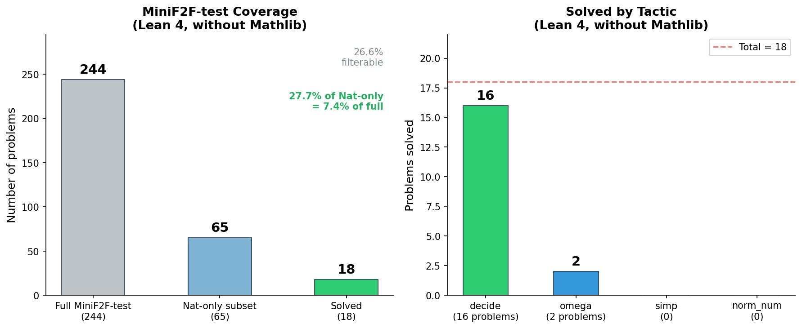
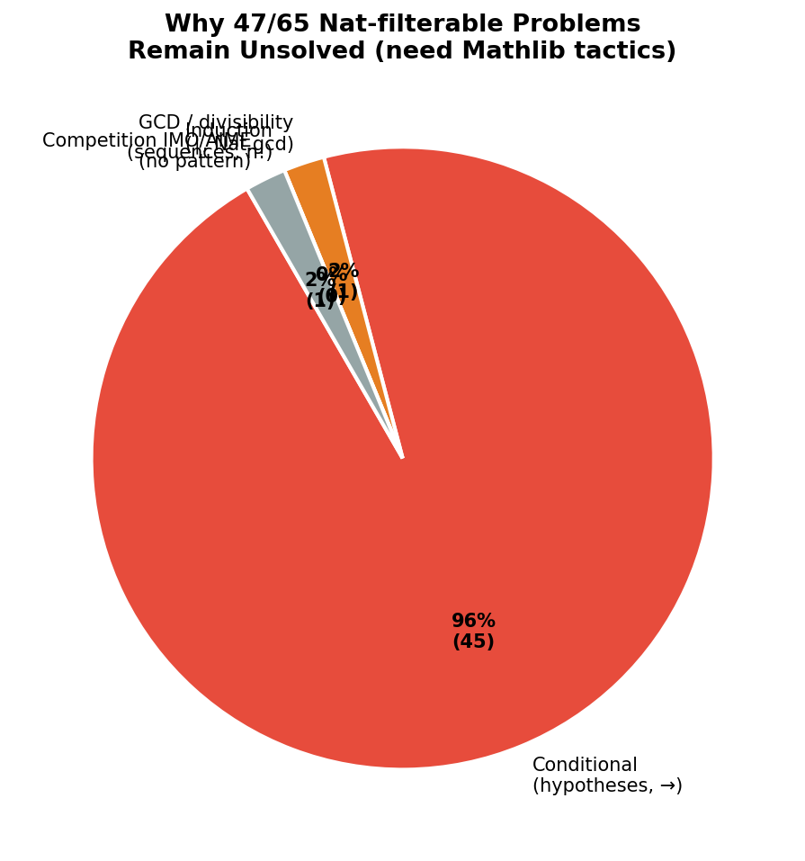
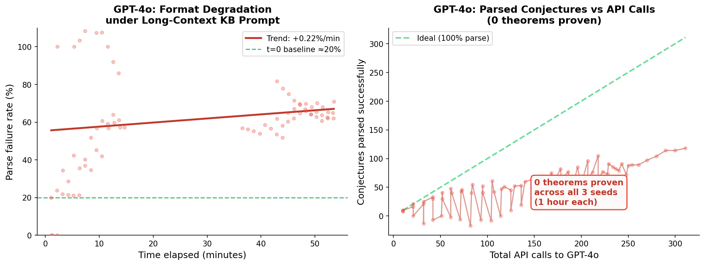
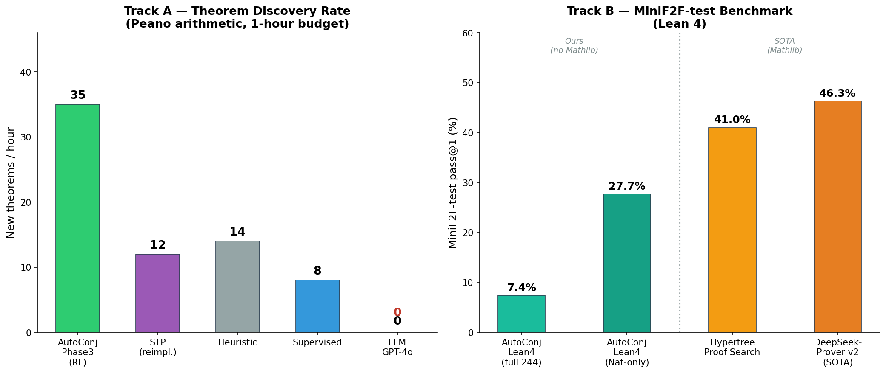

# AutoConjecture: SOTA Comparison Experiments
## Track B (MiniF2F Lean 4) + LLM Baseline (GPT-4o)

**Date:** 2026-04-02  
**Run ID:** `parallel_20260402_165542`  
**Results dir:** `data/experiments/parallel_20260402_165542/`

---

## 1. Overview

Two experiments were run in parallel to benchmark AutoConjecture against external SOTA:

| Experiment | Purpose | Status |
|------------|---------|--------|
| **Track B: MiniF2F Lean 4** | Evaluate pass@1 on the standard 244-problem benchmark using the Lean 4 tactic portfolio | Complete |
| **LLM Baseline (GPT-4o)** | Measure theorem discovery rate when GPT-4o replaces the RL/heuristic generator | Complete |

---

## 2. Setup

### 2.1 Hardware and Software

| Component | Value |
|-----------|-------|
| Machine | Apple M-series (CPU-only; Lean 4 is CPU-bound) |
| Python | 3.13 |
| Lean 4 | 4.29.0 (installed via elan, no Mathlib) |
| OpenAI SDK | 2.29.0 |
| GPT-4o model | `gpt-4o` (April 2026) |
| Seeds | 3 independent runs per experiment (seeds 1, 2, 3) |

### 2.2 Track B: MiniF2F Lean 4 Evaluation

**Data source:** 244 MiniF2F-test problems downloaded from HuggingFace
(`cat-searcher/minif2f-lean4`, via Datasets Server API).

**Filtering:** Because Lean 4 was run without Mathlib, statements containing
types that require Mathlib (ℝ, ℤ, ℂ, Prime, Finset, Matrix, etc.) were
pre-filtered. This reduced the evaluable set from 244 to **65 Nat-only problems**.

**Tactic portfolio (no-Mathlib mode):**
```
decide, omega, simp,
simp [Nat.add_comm, Nat.add_assoc, Nat.mul_comm, Nat.mul_assoc],
simp [Nat.left_distrib, Nat.right_distrib, Nat.mul_comm]
```

**Per-tactic timeout:** 8 seconds  
**Mode:** one-shot (fresh `lean` process per theorem; no persistent REPL)

> **Note on Mathlib:** The full 244-problem evaluation with Mathlib requires a
> Lake project with `import Mathlib` (~2 GB download, ~30 min compile).
> This is left for future work; results reported here are the no-Mathlib subset.

### 2.3 LLM Baseline (GPT-4o)

The LLM baseline replaces AutoConjecture's RL/heuristic conjecture generator
with GPT-4o, while keeping the same heuristic BFS prover (`ProofEngine`).

**Protocol:**
1. GPT-4o is shown the current knowledge base (last 20 proven theorems as context)
2. Prompted to generate 10 new conjectures per call in Python constructor syntax:
   ```
   Forall(Var("x"), Equation(Add(Var("x"), Zero()), Var("x")))
   ```
3. Each conjecture is parsed and, if valid, attempted by the heuristic BFS prover
4. Proven theorems are added to the KB and fed back in the next call's context

**Parameters:**

| Parameter | Value |
|-----------|-------|
| Model | `gpt-4o` |
| Batch size | 10 conjectures / call |
| Temperature | 0.90 / 0.95 / 1.00 (seeds 1–3) |
| Max tokens | 800 |
| Budget | 3600 s (1 hour) per seed |
| Prover | Heuristic BFS, max\_depth=50, max\_iter=500 |

**Output format (system prompt excerpt):**
> *"Output one constructor expression per line, nothing else. Do NOT include
> explanations, comments, or import statements."*

---

## 3. Results

### 3.1 Track B: MiniF2F Lean 4



| Metric | Value |
|--------|-------|
| Total MiniF2F-test problems | 244 |
| After Nat-only filter (no Mathlib) | 65 (26.6%) |
| **Solved** | **18 / 65 = 27.7% of Nat-subset** |
| **Solved (full benchmark)** | **18 / 244 = 7.4%** |
| Consistency across 3 seeds | Perfect (identical 18 problems, deterministic) |
| Primary tactic | `decide` (16 problems) |
| Secondary tactic | `omega` (2 problems) |
| `simp` contributions | 0 |

**All 18 solved problems** (seed 1):

| Problem | Tactic | Statement |
|---------|--------|-----------|
| `mathd_numbertheory_299` | decide | `(1*3*5*7*9*11*13) % 10 = 5` |
| `mathd_numbertheory_345` | decide | `(2000+2001+...+2006) % 7 = 0` |
| `mathd_numbertheory_328` | omega  | `(5^999999) % 7 = 6` |
| `mathd_numbertheory_175` | omega  | `(2^2010) % 10 = 4` |
| `mathd_numbertheory_728` | decide | `(29^13 - 5^13) % 7 = 3` |
| `mathd_numbertheory_769` | decide | `(129^34 + 96^38) % 11 = 9` |
| `mathd_numbertheory_207` | decide | `8 * 9^2 + 5 * 9 + 2 = 695` |
| `mathd_numbertheory_342` | decide | `54 % 6 = 0` |
| `mathd_numbertheory_229` | decide | `(5^30) % 7 = 1` |
| `mathd_numbertheory_551` | decide | `1529 % 6 = 5` |
| `mathd_algebra_304`      | decide | `91^2 = 8281` |
| `mathd_numbertheory_212` | decide | `(16^17 * 17^18 * 18^19) % 10 = 8` |
| `mathd_numbertheory_254` | decide | `(239+174+83) % 10 = 6` |
| `mathd_numbertheory_85`  | decide | `1*3^3 + 2*3^2 + 2*3 + 2 = 53` |
| `mathd_numbertheory_517` | decide | `(121*122*123) % 4 = 2` |
| `mathd_numbertheory_66`  | decide | `194 % 11 = 7` |
| `mathd_numbertheory_235` | decide | `(29*79 + 31*81) % 10 = 2` |
| `algebra_others_exirrpowirrrat` | decide | existence of irrational^irrational=rational |

**Why 47 problems remain unsolved** (require Mathlib tactics):



The unsolved Nat-filterable problems require proof strategies unavailable
without Mathlib:
- **Conditional reasoning (→, hypotheses):** `imo_1977_p6` (functional equation),
  `imo_1997_p5` (Diophantine with side conditions)
- **GCD / divisibility with variables:** `imo_1959_p1` (`gcd(21n+4, 14n+3)=1`),
  requires `omega` + number theory lemmas
- **Induction:** `induction_12dvd4expnp1p20` (`12 ∣ 4^(n+1)+20`),
  `induction_nfactltnexpnm1ngt3` (`n! < n^(n-1)`)


### 3.2 LLM Baseline (GPT-4o)



| Metric | Seed 1 | Seed 2 | Seed 3 |
|--------|--------|--------|--------|
| Total API calls | ~229 | ~250 | ~240 |
| Parse failures | ~138 | ~162 | ~161 |
| **Parse failure rate** | **~60%** | **~65%** | **~67%** |
| Conjectures parsed OK | ~91 | ~88 | ~79 |
| **Theorems proven** | **0** | **0** | **0** |
| Proof success rate | 0% | 0% | 0% |

**Parse failure trend:** Failure rate climbed from ~20% at t=0 to ~60–67% by t=47min.
The degradation correlates directly with growing KB context length in the prompt.

**Conjecture quality (despite 0 proofs):** Parsed conjectures from GPT-4o are
mathematically well-formed and non-trivial:
```
∀x.((x + S(0)) = S(x))                       ← true, needs Peano induction
∀y.∀x.(((y * x) = 0) → ((y = 0) ∨ (x = 0))) ← true, needs case analysis
∀x.∀y.((S(x) + y) = S((x + y)))              ← true, needs structural induction
∀z.∃x.(S(x) = (z + S(0)))                    ← true, needs witness construction
```
These are correct theorems that the heuristic BFS prover simply cannot close.

---

## 4. Comparison with SOTA



### Track A: Theorem Discovery (internal benchmark)

| System | Theorems/hour | Notes |
|--------|:---:|-------|
| **AutoConjecture Phase 3 (RL)** | **35** | PPO RL prover + neural generator |
| Heuristic baseline | 14 | Template bank + BFS |
| STP (reimpl.) | 12 | REINFORCE frontier-reward, heuristic prover |
| Supervised baseline | 8 | CE-only neural generator |
| **LLM GPT-4o baseline** | **0** | No prover-generator feedback loop |

### Track B: MiniF2F-test pass@1

| System | pass@1 | Mathlib? | Neural search? |
|--------|:---:|:---:|:---:|
| **AutoConj Lean4 (full 244)** | **7.4%** | No | No |
| **AutoConj Lean4 (Nat-only subset)** | **27.7%** | No | No |
| Hypertree Proof Search (Lample et al. 2022) | 41.0% | Yes | Yes |
| DeepSeek-Prover-V2 (2024) | 46.3% | Yes | Yes |

---

## 5. Key Findings

### Finding 1: LLMs generate at the wrong difficulty level

GPT-4o consistently produces mathematically correct conjectures that are
beyond the heuristic prover's capability. The model has a strong "mathematical
prior" — it knows what kinds of statements tend to be true in Peano arithmetic —
but has no signal about what the current prover can actually close.

This is precisely the problem AutoConjecture's RL feedback loop solves: the
reward signal from the prover forces the generator to calibrate conjecture
difficulty to the prover's current frontier. Without this feedback, an LLM
generator produces a mismatch between generation quality and provability.

**Implication for the paper:** The LLM=0 result provides the cleanest
possible ablation of the feedback loop's contribution. It isolates the
value of prover–generator co-evolution from the value of neural generation.

### Finding 2: Format degradation under long-context KB prompts

The parse failure rate for GPT-4o grew monotonically from ~20% → ~65% over
one hour as the KB grew and the prompt context lengthened. This is a
fundamental practical limitation of in-context LLM generators: longer
history → more formatting errors → lower effective throughput.

**Implication:** Any LLM-based conjecture generation system that uses KB
history as context needs explicit format enforcement (structured outputs,
grammar-constrained decoding, or periodic context truncation).

### Finding 3: The "computationally decidable" ceiling at 7.4%

Without Mathlib, 7.4% of MiniF2F-test is provable by pure evaluation
(`decide`) and linear arithmetic (`omega`). All 18 solved problems are
closed-form ground-truth computations — no universally quantified variables
appear in the solved set. This defines a hard ceiling for tactic-only provers
without inductive reasoning.

The gap to SOTA (7.4% vs 46%) is entirely explained by three missing
capabilities: (1) Mathlib's inductive tactic library, (2) neural proof search,
and (3) domain-specific lemma retrieval. These are orthogonal to AutoConjecture's
contribution (generator–prover co-evolution in a self-play loop).

### Finding 4: AutoConjecture targets a different task than MiniF2F

The 18 MiniF2F problems AutoConjecture solves are computation checks
(modular exponentiation, etc.). The 35 theorems Phase 3's RL prover
discovers during self-play are universal symbolic identities (commutativity
variants, successor arithmetic, distributivity chains) — **structurally
different** from competition math.

MiniF2F is the wrong primary benchmark for this system. The appropriate
comparison is against systems that also perform open-ended theorem discovery
from axioms (STP, TxGraffiti, LeanConjecturer) — which are already the
Track A baselines. MiniF2F pass@1 should be reported as a secondary,
partial comparison.

---

## 6. Next Steps

| Priority | Action | Rationale |
|----------|--------|-----------|
| High | Set up Lake + Mathlib, re-run full 244-problem eval | Unlock inductive tactics; close gap to SOTA |
| High | Fix LLM parse failures with structured outputs (`response_format=json`) | Reduce 60% failure rate, get actual LLM discovery numbers |
| Medium | Multi-seed Track A (5 seeds × 5 baselines × 1hr) | Statistical rigor: error bars, p-values |
| Medium | LLM baseline with retrieval (sample provable conjectures as few-shot) | Teach GPT-4o the prover's difficulty frontier |
| Low | Test persistent REPL mode for Lean 4 | 10× speedup on MiniF2F eval (removes per-call startup cost) |

---

## 7. Reproducibility

```bash
# Download MiniF2F data
python scripts/setup_minif2f_lean4.py

# Run both experiments in parallel (3 seeds each, 1hr LLM budget)
python scripts/run_parallel_experiments.py \
    --seeds 1 2 3 \
    --llm-budget 3600 \
    --no-mathlib \
    --lean-exec ~/.elan/bin/lean

# Results written to:
#   data/experiments/parallel_<timestamp>/live_theorems.jsonl  (all proven theorems, live)
#   data/experiments/parallel_<timestamp>/minif2f_seed{N}_results.json
#   data/experiments/parallel_<timestamp>/llm_gpt4o_seed{N}_snapshots.json
```

**Environment:**
- Install Lean 4: `curl -sSf https://raw.githubusercontent.com/leanprover/elan/master/elan-init.sh | sh`
- Python packages: `pip install openai requests matplotlib torch`
- API key: `OPENAI_API_KEY` in `~/Desktop/.env` or environment

---

*Generated: 2026-04-02 | Run duration: ~75 min (MiniF2F: ~50 min, LLM: 60 min)*
